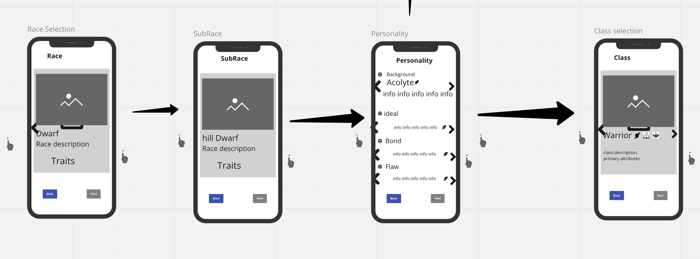
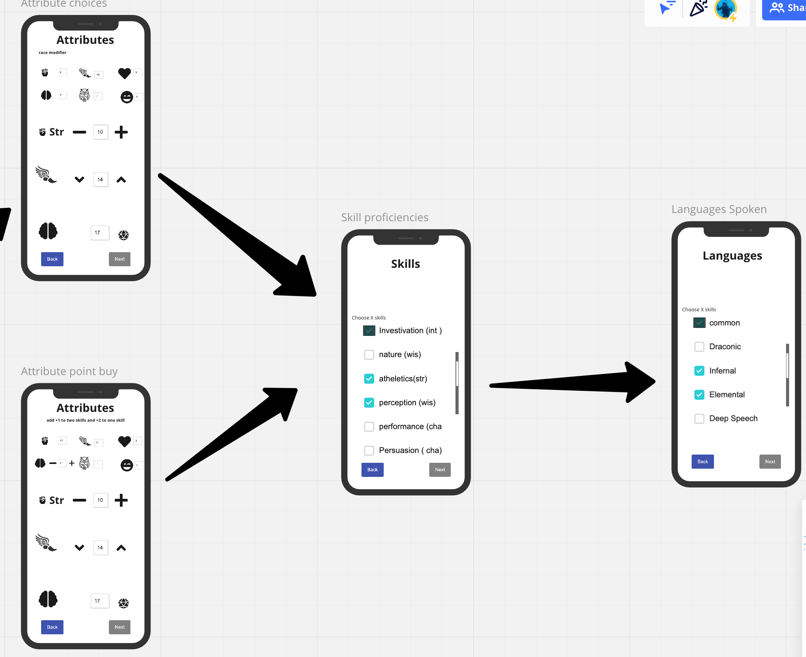
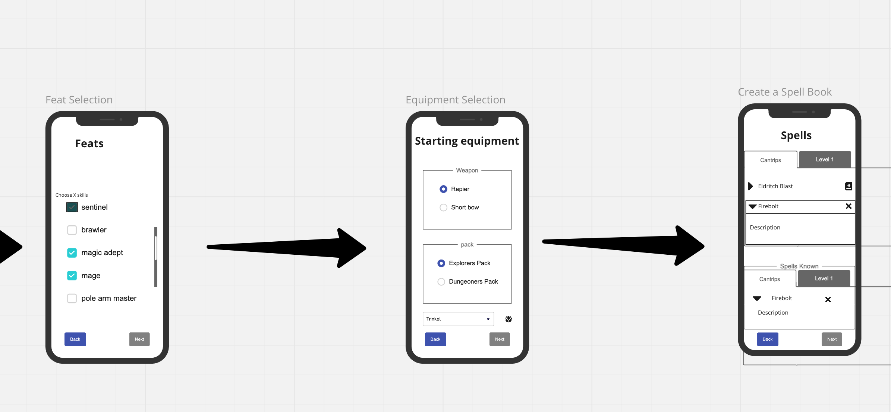

# DnD Masters

original project developed and designed by:

- [Chris Bohne](https://github.com/chrisbohne)
- [David Rozsavolgyi](https://github.com/muraminsav)
- [Nina Barbakadze](https://github.com/ninabarbakadze)
- [Jacob Ross](https://github.com/JakeJustLearning)

## Summary

DnD Masters is a game management and online game session tool for Dungeons and Dragons fifth edition. The original project was accomplished in two weeks with the goal of allowing users to be guided through every aspect of creating and setting up their game through multi step wizards, as well as running online game sessions together.

## Tech Stack

### Front End :

- React front end framework
- Redux for state management and thunk middleware
- Gsep, for animations and image movement
- socket.io-client for client side websocket management

### Back End:

- Express back end node framework
- Passport for Authentication
- socket.io for server side websocket management
- mongoose as an ORM
- mongoDB as our database layer

### planning and design

- Miro for prototyping and design
- Figma for design
- Notion for note taking and planning

## Main Functionality

The main functionality revolved around a group of wizards that walked users through the various steps and logic necessary to create different parts of the Dnd Game. Each wizard is made up of multiple step components that are managed by a wizard component. Each wizard ends in the ability to edit the created item before saving it to your user.

As well a game room that allows the combined use of the created assets through a multiplayer experience is available allowing the use of overworld maps and positioning of players.

### Character Creation and Management

Character creation walks the user the the many steps necessary to create their own first level character. The steps that are taken and the choices available at each step are affected by prevoius choices in the wizard. This demands that the character creation wizard is highly responsive.

**Designs**
 

### Map Creation and Management

**Designs**

### Game Creation

**Designs**

### Online Game Session

**Designs**

### Backend Architechture

## Desired Future Functionality

### Encounter Creation and Management Tool

**Designs**

### Encounter play and logic in online sessions

**Designs**

### DM and Player specific tools

###

## Challenges of the Project

## Insights and learnings
